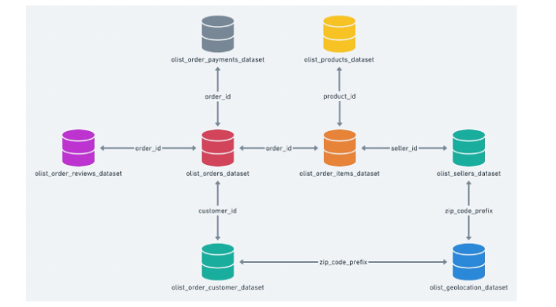

## Sobre o conjunto de dados

### Brazilian E-Commerce Public Dataset by Olist

Este é um conjunto de dados público de comércio eletrônico brasileiro de pedidos feitos na Olist Store . O conjunto de dados contém informações de 100 mil pedidos de 2016 a 2018 feitos em vários marketplaces no Brasil. Seus recursos permitem visualizar um pedido em múltiplas dimensões: desde status do pedido, preço, desempenho de pagamento e frete até localização do cliente, atributos do produto e finalmente avaliações escritas pelos clientes. Também lançamos um conjunto de dados de geolocalização que relaciona os CEPs brasileiros às coordenadas lat/lng.

Estes são dados comerciais reais, foram anonimizados e as referências às empresas e parceiros.

### Data Schema

Os dados são divididos em vários conjuntos de dados para melhor compreensão e organização.

### Desafio de Análise Exploratória:

- [Brazilian E-Commerce Public Dataset by Olist](analise_brasilian_ecommerce.ipynb)